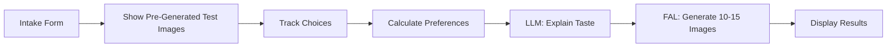

# ArtSwipe MVP - Product Requirements Document
**Version 2.0 | August 2025**

## Executive Summary

ArtSwipe learns what art you like in 60 seconds through smart image comparisons, explains your taste in plain English, then generates 10-15 personalized artworks you can download or print.

**MVP Focus**: Simple taste discovery → Clear explanation → Personalized generation

---

## 1. User Flow (3 Steps)

### Step 1: Quick Intake (10 seconds)
```
"Where will your art live?" → Living Room
"What colors do you prefer?" → Earth Tones  
"What size?" → Medium (16x20")
```

### Step 2: Taste Discovery (45 seconds)
```
Show 15-25 pre-generated image pairs
User picks preferred image from each pair
Algorithm learns style, complexity, and subject preferences
```

### Step 3: Results (30 seconds)
```
"Your Art DNA: You love minimalist nature art with organic shapes..."
Generate 10-15 personalized images
Show each with its prompt for transparency
```

---

## 2. Technical Architecture (Simplified)



### Tech Stack
- **Frontend**: Next.js (single web app for MVP)
- **Database**: PostgreSQL (Supabase)
- **Image Generation**: FAL.ai (FLUX.1-schnell for speed)
- **LLM**: OpenRouter (GPT-4o-mini for cost)
- **Hosting**: Vercel

---

## 3. Pre-Generated Test Image Database

### One-Time Setup (Before Launch)

Generate 60 test images covering key dimensions:

```python
# Generate test images ONCE before launch
TEST_IMAGE_SPECS = [
    # STYLE TEST SET (24 images)
    # Same subject (abstract shapes), different styles
    {"subject": "abstract circles", "style": "minimalist", "palette": "neutral"},
    {"subject": "abstract circles", "style": "bold brushstrokes", "palette": "neutral"},
    {"subject": "abstract circles", "style": "geometric", "palette": "neutral"},
    {"subject": "abstract circles", "style": "watercolor", "palette": "neutral"},
    {"subject": "abstract circles", "style": "photographic", "palette": "neutral"},
    {"subject": "abstract circles", "style": "line art", "palette": "neutral"},
    
    # Repeat with landscape subject
    {"subject": "mountain landscape", "style": "minimalist", "palette": "neutral"},
    {"subject": "mountain landscape", "style": "impressionist", "palette": "neutral"},
    {"subject": "mountain landscape", "style": "geometric", "palette": "neutral"},
    {"subject": "mountain landscape", "style": "photographic", "palette": "neutral"},
    
    # Repeat with botanical subject  
    {"subject": "leaf pattern", "style": "minimalist", "palette": "neutral"},
    {"subject": "leaf pattern", "style": "detailed botanical", "palette": "neutral"},
    {"subject": "leaf pattern", "style": "abstract", "palette": "neutral"},
    {"subject": "leaf pattern", "style": "watercolor", "palette": "neutral"},
    
    # COMPLEXITY TEST SET (15 images)
    # Same style, varying complexity
    {"subject": "abstract composition", "complexity": "single element"},
    {"subject": "abstract composition", "complexity": "3 simple shapes"},
    {"subject": "abstract composition", "complexity": "5-7 layered elements"},
    {"subject": "abstract composition", "complexity": "10+ intricate details"},
    {"subject": "abstract composition", "complexity": "dense maximum complexity"},
    
    # SUBJECT TEST SET (15 images)
    # Same style, different subjects
    {"style": "minimalist", "subject": "geometric shapes"},
    {"style": "minimalist", "subject": "nature elements"},
    {"style": "minimalist", "subject": "architectural forms"},
    {"style": "minimalist", "subject": "human figures"},
    {"style": "minimalist", "subject": "abstract patterns"},
    
    # COLOR TEST SET (6 images)
    # Same composition, different palettes
    {"subject": "abstract", "palette": "black and white"},
    {"subject": "abstract", "palette": "earth tones"},
    {"subject": "abstract", "palette": "ocean blues"},
    {"subject": "abstract", "palette": "warm sunset"},
    {"subject": "abstract", "palette": "pastels"},
    {"subject": "abstract", "palette": "jewel tones"}
]

# One-time generation script
async def generate_test_deck():
    for spec in TEST_IMAGE_SPECS:
        prompt = build_prompt(spec)
        image_url = await fal.generate(
            prompt=prompt,
            model="flux-schnell",  # Fast and cheap for test images
            size="512x512"  # Smaller size for testing
        )
        
        # Save to database
        save_test_image(
            url=image_url,
            metadata=spec,
            prompt=prompt
        )
```

### Database Schema

```sql
-- Pre-generated test images
CREATE TABLE test_images (
    id SERIAL PRIMARY KEY,
    image_url TEXT NOT NULL,
    style TEXT,
    subject TEXT,
    palette TEXT,
    complexity TEXT,
    test_category TEXT NOT NULL, -- 'style', 'complexity', 'subject', 'color'
    prompt_used TEXT,
    created_at TIMESTAMP DEFAULT NOW()
);

-- User sessions
CREATE TABLE sessions (
    id UUID PRIMARY KEY DEFAULT gen_random_uuid(),
    email TEXT,
    stated_room TEXT,
    stated_palette TEXT,
    stated_size TEXT,
    created_at TIMESTAMP DEFAULT NOW()
);

-- User choices during discovery
CREATE TABLE choices (
    id SERIAL PRIMARY KEY,
    session_id UUID REFERENCES sessions(id),
    shown_left_id INTEGER REFERENCES test_images(id),
    shown_right_id INTEGER REFERENCES test_images(id),
    choice TEXT CHECK (choice IN ('left', 'right')),
    choice_number INTEGER,
    response_time_ms INTEGER,
    created_at TIMESTAMP DEFAULT NOW()
);

-- Generated artworks
CREATE TABLE generated_artworks (
    id UUID PRIMARY KEY DEFAULT gen_random_uuid(),
    session_id UUID REFERENCES sessions(id),
    image_url TEXT NOT NULL,
    prompt TEXT NOT NULL,
    order_index INTEGER,
    created_at TIMESTAMP DEFAULT NOW()
);

-- User profiles (learned preferences)
CREATE TABLE user_profiles (
    session_id UUID PRIMARY KEY REFERENCES sessions(id),
    preferred_style TEXT,
    preferred_complexity FLOAT,
    preferred_subjects TEXT[],
    preferred_palette TEXT,
    explanation_text TEXT,
    confidence_score FLOAT,
    created_at TIMESTAMP DEFAULT NOW()
);
```

---

## 4. Taste Discovery Algorithm (Simple)

```python
class TasteDiscovery:
    """Simple preference learning without complex Bayesian models"""
    
    def __init__(self, stated_preferences):
        self.stated_room = stated_preferences['room']
        self.stated_palette = stated_preferences['palette']
        self.stated_size = stated_preferences['size']
        
        # Simple counters for preferences
        self.style_votes = defaultdict(int)
        self.subject_votes = defaultdict(int)
        self.complexity_sum = 0
        self.complexity_count = 0
        
        # Load pre-generated test images
        self.test_images = load_test_images()
        self.shown_pairs = []
        
    def get_next_pair(self, interaction_number):
        """Simple adaptive selection of next test pair"""
        
        if interaction_number < 8:
            # First 8: Test styles
            return self.get_style_test_pair()
        elif interaction_number < 13:
            # Next 5: Test complexity
            return self.get_complexity_test_pair()
        elif interaction_number < 18:
            # Next 5: Test subjects
            return self.get_subject_test_pair()
        else:
            # Final: Confirm top preferences
            return self.get_confirmation_pair()
    
    def process_choice(self, left_image, right_image, choice):
        """Update preference counters based on choice"""
        
        chosen = left_image if choice == 'left' else right_image
        rejected = right_image if choice == 'left' else left_image
        
        # Update style votes
        if chosen.style and rejected.style:
            self.style_votes[chosen.style] += 1
            self.style_votes[rejected.style] -= 0.5  # Penalize less
        
        # Update subject votes
        if chosen.subject and rejected.subject:
            self.subject_votes[chosen.subject] += 1
            
        # Update complexity (if both have complexity scores)
        if chosen.complexity is not None:
            self.complexity_sum += chosen.complexity
            self.complexity_count += 1
    
    def get_final_preferences(self):
        """Calculate final preference profile"""
        
        # Top style (highest votes)
        top_style = max(self.style_votes, key=self.style_votes.get)
        
        # Top subjects (top 3)
        sorted_subjects = sorted(self.subject_votes.items(), 
                               key=lambda x: x[1], reverse=True)
        top_subjects = [s[0] for s in sorted_subjects[:3]]
        
        # Average complexity
        avg_complexity = (self.complexity_sum / self.complexity_count 
                         if self.complexity_count > 0 else 0.5)
        
        # Use stated palette unless strongly overridden
        final_palette = self.stated_palette
        
        return {
            'style': top_style,
            'subjects': top_subjects,
            'complexity': avg_complexity,
            'palette': final_palette
        }
```

---

## 5. LLM Integration for Taste Explanation

```python
async def generate_taste_explanation(preferences, choices_made):
    """Use LLM to create human-readable explanation of preferences"""
    
    prompt = f"""
    Based on these art preferences discovered through user choices:
    - Preferred style: {preferences['style']}
    - Preferred subjects: {', '.join(preferences['subjects'])}
    - Complexity level: {preferences['complexity']} (0=minimal, 1=complex)
    - Color palette: {preferences['palette']}
    - Room: {preferences['room']}
    
    The user consistently chose {preferences['style']} style images over others,
    showed preference for {preferences['subjects'][0]} subjects,
    and selected {get_complexity_description(preferences['complexity'])} compositions.
    
    Write a 2-3 sentence friendly explanation of their art taste that:
    1. Sounds personal and insightful
    2. Uses accessible language (no art jargon)
    3. Makes them feel understood
    4. Mentions specific combinations they'd love
    
    Format: Start with "Your Art DNA:" then the explanation.
    """
    
    response = await openrouter.complete(
        model="openai/gpt-4o-mini",  # Cheap and fast
        prompt=prompt,
        max_tokens=150
    )
    
    return response.text

# Example output:
# "Your Art DNA: You're drawn to minimalist nature art that brings calm without 
# overwhelming the space. You love when organic shapes like leaves and mountains 
# are simplified to their essence, especially in warm earth tones that create a 
# cozy, grounded feeling. The perfect piece for you balances simplicity with 
# just enough detail to keep things interesting."
```

---

## 6. Image Generation (Final Step)

```python
async def generate_personalized_artworks(preferences, count=12):
    """Generate 10-15 variations based on learned preferences"""
    
    prompts = []
    
    # Generate variations combining preferences
    base_variations = [
        # Core preference
        f"{preferences['style']} style {preferences['subjects'][0]}",
        
        # Mix top two subjects
        f"{preferences['style']} style {preferences['subjects'][0]} with {preferences['subjects'][1]} elements",
        
        # Vary complexity slightly
        f"{preferences['style']} style {preferences['subjects'][0]}, slightly more minimal",
        f"{preferences['style']} style {preferences['subjects'][0]}, slightly more detailed",
        
        # Try different moods
        f"{preferences['style']} style {preferences['subjects'][0]}, morning light",
        f"{preferences['style']} style {preferences['subjects'][0]}, dramatic shadows",
        
        # Mix in secondary subject
        f"{preferences['style']} style {preferences['subjects'][1]}",
        
        # Abstract interpretation
        f"abstract interpretation of {preferences['subjects'][0]} in {preferences['style']} style",
        
        # Seasonal variations
        f"{preferences['style']} style {preferences['subjects'][0]}, autumn mood",
        f"{preferences['style']} style {preferences['subjects'][0]}, spring feeling",
        
        # Texture variations
        f"{preferences['style']} style {preferences['subjects'][0]}, smooth textures",
        f"{preferences['style']} style {preferences['subjects'][0]}, rich textures"
    ]
    
    # Add complexity and palette to each
    for base in base_variations[:count]:
        full_prompt = f"{base}, {get_complexity_descriptor(preferences['complexity'])}, "
        full_prompt += f"{preferences['palette']} color palette, "
        full_prompt += f"high quality wall art, {preferences['room']} decor"
        prompts.append(full_prompt)
    
    # Generate all images
    results = []
    for prompt in prompts:
        image_url = await fal.generate(
            model="flux-dev",  # Better quality for final output
            prompt=prompt,
            size="1024x1024"  # Full size for download
        )
        
        results.append({
            'url': image_url,
            'prompt': prompt  # Show prompt for transparency
        })
    
    return results
```

---

## 7. Frontend Components (Simple)

```jsx
// Main flow component
function ArtSwipeFlow() {
  const [stage, setStage] = useState('intake');
  const [preferences, setPreferences] = useState({});
  const [currentPair, setCurrentPair] = useState(null);
  const [interactionCount, setInteractionCount] = useState(0);
  const [explanation, setExplanation] = useState('');
  const [generatedArt, setGeneratedArt] = useState([]);

  // Stage 1: Intake
  if (stage === 'intake') {
    return (
      <IntakeForm 
        onComplete={(data) => {
          setPreferences(data);
          setStage('discovery');
          loadFirstPair();
        }}
      />
    );
  }

  // Stage 2: Discovery
  if (stage === 'discovery') {
    return (
      <div className="discovery-container">
        <ProgressBar current={interactionCount} total={20} />
        
        <h2>Which speaks to you more?</h2>
        
        <div className="image-pair">
           handleChoice('left')}
            className="choice-image"
          />
          
          <div className="divider">OR</div>
          
           handleChoice('right')}
            className="choice-image"
          />
        </div>
      </div>
    );
  }

  // Stage 3: Results
  if (stage === 'results') {
    return (
      <div className="results-container">
        <div className="explanation-box">
          <h2>Your Art DNA</h2>
          <p>{explanation}</p>
        </div>
        
        <h3>Your Personalized Collection</h3>
        
        <div className="generated-grid">
          {generatedArt.map((art, i) => (
            <div key={i} className="artwork-card">
              
              <button onClick={() => download(art.url)}>
                Download
              </button>
              <details>
                <summary>How we made this</summary>
                <p className="prompt">{art.prompt}</p>
              </details>
            </div>
          ))}
        </div>
        
        <button onClick={startOver}>Try Again</button>
      </div>
    );
  }
}
```

---

## 8. API Endpoints (Minimal)

```typescript
// Start session
POST /api/session/start
Body: { room, palette, size }
Response: { session_id, first_pair }

// Submit choice
POST /api/choice
Body: { session_id, pair_id, choice, response_time }
Response: { next_pair } or { complete: true, preferences }

// Generate results
POST /api/generate
Body: { session_id, preferences }
Response: { explanation, artworks: [{url, prompt}, ...] }
```

---

## 9. Cost Analysis (Per User)

| Step | Cost | Notes |
|------|------|-------|
| Taste Discovery | $0 | Uses pre-generated images |
| LLM Explanation | $0.002 | ~500 tokens with GPT-4o-mini |
| Image Generation | $0.15 | 10 images × $0.015 (FLUX-dev) |
| **Total per user** | **$0.152** | |

**Revenue Model**:
- Free: 3 low-res downloads
- Paid: $4.99 for all high-res images + future regeneration

---

## 10. MVP Success Metrics

| Metric | Target | Measurement |
|--------|--------|-------------|
| Completion Rate | >70% | Users who finish discovery |
| Time to Complete | <90 seconds | Total session time |
| "Love It" Rate | >60% | Users who rate results 4+ stars |
| Conversion | >10% | Free users who pay for downloads |

---

## 11. Launch Checklist

### Week 1: Backend
- [ ] Generate 60 test images with FAL
- [ ] Set up PostgreSQL database
- [ ] Build preference calculation logic
- [ ] Integrate OpenRouter for explanations

### Week 2: Frontend
- [ ] Intake form (3 questions)
- [ ] Image comparison UI
- [ ] Results gallery
- [ ] Download functionality

### Week 3: Testing & Launch
- [ ] Test with 20 friends
- [ ] Adjust test image set based on feedback
- [ ] Deploy to Vercel
- [ ] Add analytics (Mixpanel free tier)

---

## 12. Post-MVP Roadmap

1. **Save & Return**: User accounts to save preferences
2. **Print Fulfillment**: Partner with Printful for physical prints
3. **Room Mockups**: Show art in room settings
4. **Social Sharing**: Share art DNA results
5. **Collaborative Filtering**: Improve priors based on all users

---

## Summary

This MVP focuses on the core value: discovering art taste and generating personalized pieces. By pre-generating test images and keeping the algorithm simple, we can launch in 3 weeks with <$100 in setup costs and $0.15 per user in variable costs.

The key insight: We don't need complex Bayesian models for MVP. Simple vote counting + good test images + LLM explanation = magical user experience.